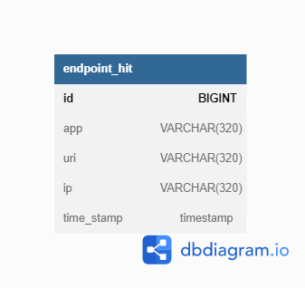
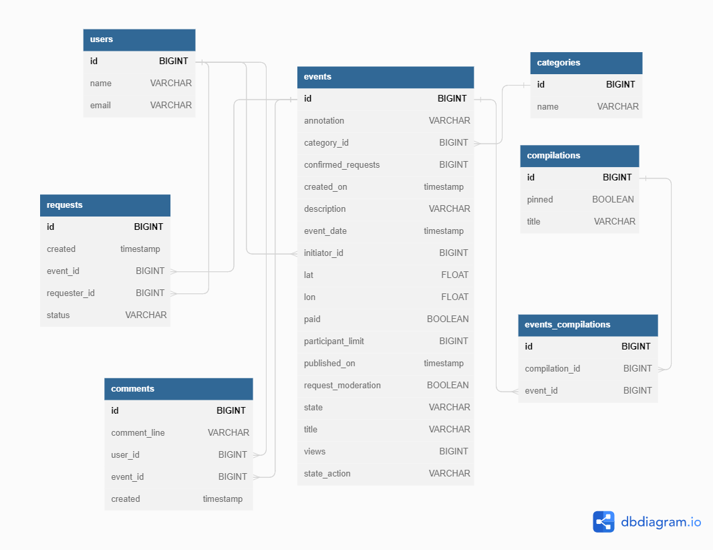

# java-explore-with-me

### :pushpin: Языки и инструменты:

&nbsp&nbsp;
&nbsp&nbsp;
&nbsp&nbsp;
&nbsp&nbsp;

**Свободное время** — ценный ресурс. Ежедневно мы планируем, как его потратить — куда и с кем сходить. Сложнее всего в таком планировании поиск информации и переговоры. Нужно учесть много деталей: какие намечаются мероприятия, свободны ли в этот момент друзья, как всех пригласить и где собраться.

Разработанное приложение — афиша. В этой афише можно предложить какое-либо событие от выставки до похода в кино и собрать компанию для участия в нём.

**Два сервиса:**
Основной сервис содержит всё необходимое для работы продукта;
сервис статистики будет хранить количество просмотров и позволит делать различные выборки для анализа работы приложения.

---

## Основной сервис
API основного сервиса разделите на три части:
* публичная будет доступна без регистрации любому пользователю сети;
* закрытая будет доступна только авторизованным пользователям;
* административная — для администраторов сервиса.

К каждой из частей есть свои требования. Рассмотрим их.
### Публичный API
Публичный предоставляет возможности поиска и фильтрации событий:
* Сортировка списка событий организована либо по количеству просмотров, которое будет запрашиваться в сервисе статистики, либо по датам событий;
* при просмотре списка событий возвращается только краткая информация о мероприятиях;
* просмотр подробной информации о конкретном событии можно просмотреть отдельно (через отдельный эндпоинт);
* каждое событие относится к какой-то из закреплённых в приложении категорий;
* также есть возможность получения всех имеющихся категорий и подборок событий (такие подборки будут составлять администраторы ресурса);
* каждый публичный запрос для получения списка событий или полной информации о мероприятии фиксируется сервисом статистики.

### API для авторизованных пользователей
Закрытая часть API реализует возможности зарегистрированных пользователей продукта.
* авторизованные пользователи имеют возможность добавлять в приложение новые мероприятия, редактировать их и просматривать после добавления;
* настроена подача заявок на участие в интересующих мероприятиях;
* создатель мероприятия имеет возможность подтверждать заявки, которые отправили другие пользователи сервиса.
* участник мероприятия может оставлять комментарии к событию, организатор событий может отвечать.

### API для администратора
Административная часть API предоставляет возможности настройки и поддержки работы сервиса.
* настроено добавление, изменение и удаление категорий для событий;
* есть возможность добавлять, удалять и закреплять на главной странице подборки мероприятий;
* налажена модерацию событий, размещённых пользователями, — публикация или отклонение;
* также настроено управление пользователями — добавление, активация, просмотр и удаление.
* модерация комментариев.

---

## Сервис статистики
Второй сервис — сервис статистики. Он будет собирать информацию. Во-первых, о количестве обращений пользователей к спискам событий и, во-вторых, о количестве запросов к подробной информации о событии. На основе этой информации должна формироваться статистика о работе приложения.

Функционал сервиса статистики содержат:
* запись информации о том, что был обработан запрос к эндпоинту API;
* предоставление статистики за выбранные даты по выбранному эндпоинту.
Чтобы можно было использовать сервис статистики, разработан HTTP-клиент. Он отправляет запросы и обрабатывает ответы. 

---

## Спецификация API
Для обоих сервисов разработана подробная спецификация API:
* спецификация основного сервиса: [ewm-main-service-spec.json](ewm-main-service-spec.json);
* спецификация сервиса статистики: [ewm-stats-service.json](ewm-stats-service-spec.json)

---

## Хранение данных
Хранение данных организованно по сервисам с использованием базы данных PostgreSQL.

# StatsService

## Таблица ENDPOINT_HIT:

1. id - PRIMARY KEY AUTO INCREMENT
2. app
3. uri
4. ip
5. time_stamp

# EwmService + Feature_Comments

## Таблица USERS

1. id - PRIMARY KEY AUTO INCREMENT
2. name
3. email

## Таблица CATEGORIES

1. id - PRIMARY KEY AUTO INCREMENT
2. name

## Таблица EVENTS

1. id - PRIMARY KEY AUTO INCREMENT
2. annotation 
3. category_id - FOREIGN KEY (CATEGORIES)
4. confirmed_requests
5. created_on   
6. description  
7. event_date  
8. initiator_id - FOREIGN KEY (USERS)  
9. lat      
10. lon       
11. paid       
12. participant_limit 
13. published_on     
14. request_moderation 
15. state            
16. title          
17. views           
18. state_action

## Таблица REQUESTS

1. id - PRIMARY KEY AUTO INCREMENT
2. created  
3. event_id - FOREIGN KEY (EVENTS)  
4. requester_id - FOREIGN KEY (USERS)
5. status

## Таблица COMPILATIONS

1. id - PRIMARY KEY AUTO INCREMENT
2. pinned
3. title

## Таблица EVENTS_COMPILATIONS

1. id - PRIMARY KEY AUTO INCREMENT
2. compilation_id - FOREIGN KEY (COMPILATIONS)
3. event_id - FOREIGN KEY (EVENTS)  

## Таблица COMMENTS

1. id - PRIMARY KEY AUTO INCREMENT
2. comment_line
3. user_id - FOREIGN KEY (USERS)
4. event_id - FOREIGN KEY (EVENTS)
5. created